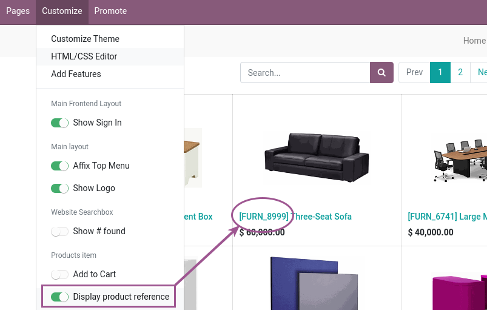

Just install and the products will be shown with their unit of measure.

You can enable or disable for each template and website in the *Customize* frontend
menu setting the *Display product unit of measure* option on or off.

